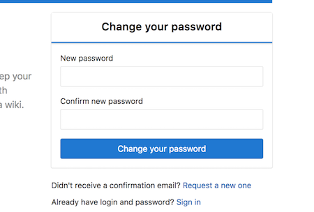
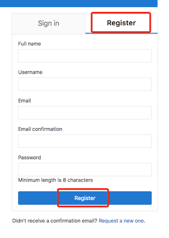
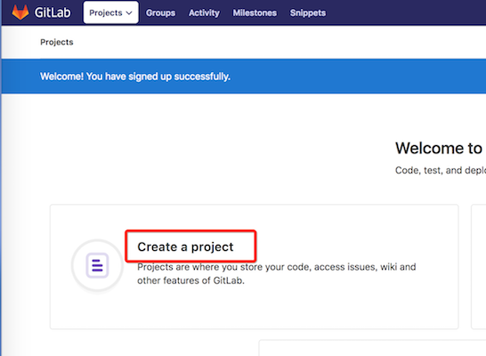

#### 一、下载镜像（官方版本是：gitlab/gitlab-ce:latest，为了提升速度我们这里使用阿里云的仓库）
```bash
$ docker pull registry.cn-hangzhou.aliyuncs.com/imooc/gitlab-ce:latest
```

#### 二、创建GitLab工作目录
```bash
$ mkdir -p /home/gitlab
```

#### 三、创建 [vi /home/gitlab/start.sh] GitLab启动脚本
```bash
#!/bin/bash
# 绑定主机名或IP也可以写域名（注意：这个是变量以供下面${HOST_NAME}使用）
HOST_NAME=192.168.78.130
# GitLab工作目录（注意这个是变量以供下面${GITLAB_DIR}使用）                        
GITLAB_DIR=/home/gitlab                                
docker stop gitlab
docker rm gitlab
# -v 部分为数据挂载目录
# -p 部分为端口映射包括http和ssh连接，前面的宿主机端口，后面的容器端口
docker run -d 
    --hostname ${HOST_NAME} 
    --name gitlab 
    -p 9443:443 -p 9199:80 -p 2222:22 
    -v ${GITLAB_DIR}/config:/etc/gitlab 
    -v ${GITLAB_DIR}/logs:/var/log/gitlab 
    -v ${GITLAB_DIR}/data:/var/opt/gitlab 
    registry.cn-hangzhou.aliyuncs.com/imooc/gitlab-ce:latest
```

#### 四、启动Gitlab（注意：Gitlab首次启动后会生成初始配置，以后就可以直接去修改配置了）
```bash
$ sh /home/gitlab/start.sh
```

#### 五、修改 [vi ${GITLAB_DIR}/config/gitlab.rb] 自定义Gitlab配置（注意：配置生效需要重启Gitlab）
```bash
# 宿主机ssh端口（注意：这个是Gitlab使用sshKey连接所使用的端口）
gitlab_rails['gitlab_shell_ssh_port'] = 2222
```

#### 六、账户管理，项目创建
##### 6.1、打开首页（http://192.168.78.130:9199/）

##### 6.2、设置管理员密码（注意：首先根据提示输入管理员密码，这个密码是管理员用户的密码。对应的用户名是root，用于以管理员身份登录Gitlab）


##### 6.3、创建用户账号（设置好密码后去注册一个普通账号）


##### 6.4、创建项目（注册成功后会跳到首页，我们创建一个项目，名字大家随意）



#### 七、添加ssh key以后本地pull/push就简单啦
##### 7.1、生成密钥
```bash
$ ssh-keygen -t rsa -C "576416024@qq.com"
$ cat ~/.ssh/id_rsa.pub
```

##### 7.2、添加ssh key到Gitlab


#### 八、克隆代码，测试提交
```bash
#clone代码
$ git clone ssh://git@192.168.78.130:2222/michael/test.git
#写一个文件
$ cd test && echo test > test
#push
$ git add .
$ git commit -m "test"
$ git push origin master
```