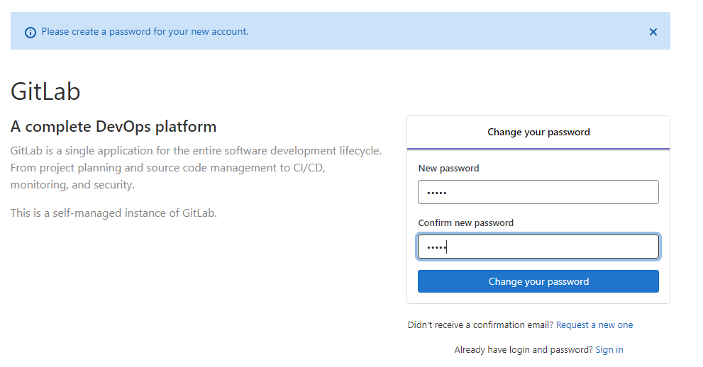

#### 一、环境准备关闭 [vi /etc/sysconfig/selinux]  系统SELINUX（注意：生产环境不建议关闭SELINUX，配置生效需要重启机器）
```bash
SELINUX=disabled

# 重启系统以生效关闭SELINUX配置
$ reboot
```

#### 二、下载以及安装，[官方搭建文档](https://docs.gitlab.com/omnibus/installation/)
```bash
$ mkdir -p /home/gitlab && cd /home/gitlab

# 安装Gitlab依赖组件（注意：postfix 是邮件组件）
$ yum -y install curl policycoreutils openssh-server openssh-clients postfix

# 下载适用于Centos7的Gitlab安装包
$ wget https://mirrors.tuna.tsinghua.edu.cn/gitlab-ce/yum/el7/gitlab-ce-13.9.3-ce.0.el7.x86_64.rpm

# 安装Gitlab
$ rpm -Uvh gitlab-ce-13.9.3-ce.0.el7.x86_64.rpm
```

#### 三、修改 [vi /etc/gitlab/gitlab.rb] 配置
```bash
# 服务绑定的地址，可以写域名（注意：其实这个是Nginx绑定的地址，因为要访问Gitlab其实是通过Nginx做代理转发的）
external_url 'http://192.168.229.143'
# Nginx服务绑定地址（注意：因为要访问Gitlab其实是通过Nginx做代理转发的）
nginx['listen_addresses'] = ['192.168.229.143', '[::]']
# Nginx服务绑定端口（注意：因为要访问Gitlab其实是通过Nginx做代理转发的）
nginx['listen_port'] = 9199
```

#### 四、启动Gitlab邮件组件（Gitlab邮件通知相关需要）
```bash
# 查看邮件组件的状态（可以看到是否启动）
$ systemctl status postfix
# 启动邮件组件
$ systemctl start postfix
# 停止邮件组件
$ systemctl stop postfix
# 开机启动邮件组件
$ systemctl enable postfix
```

#### 五、启动Gitlab以及相关服务
```bash
# 查看Gitlab管理命令的使用方法
$ gitlab-ctl --help

# 重新配置Gitlab以及相关组件并启动相关服务（如果服务已经启动了就重启）
# 注意：每次修改 /etc/gitlab/gitlab.rb 配置文件都需要执行该命令以生效；还有该命令执行可能需要很长时间
$ gitlab-ctl reconfigure

# 启动Gitlab以及相关服务
$ gitlab-ctl start

# 重启Gitlab以及相关服务
$ gitlab-ctl restart

# 停止Gitlab以及相关服务
$ gitlab-ctl stop
```

#### 六、首次访问Gitlab配置管理员密码（注意：用户名默认是 root），如下图（访问地址：http://192.168.229.143:9199/）

